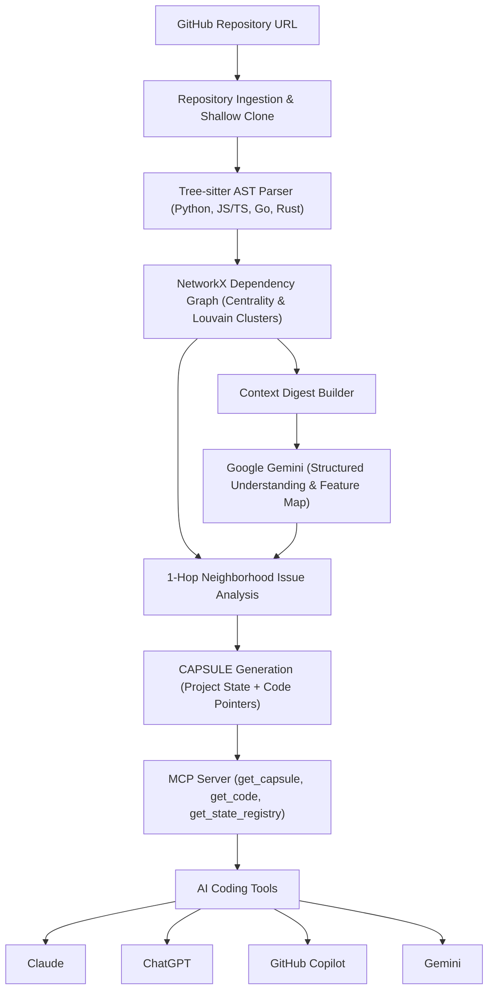

# FLux

Context portability layer for AI coding tools powered by Tree-sitter AST analysis, NetworkX graph theory, Google Gemini, and the CAPSULE system for seamless project state transfer.

---

## Executive Summary

Developers increasingly use multiple AI coding tools across projects, losing context with each switch. New contributors to open-source projects face cognitive friction parsing complex codebases and mapping issues to source files.

Amica provides a SaaS layer that sits between developers and their AI coding tools (Claude, GPT, Gemini, GitHub Copilot). It transforms any GitHub repository into an interactive dependency graph, generates compact CAPSULE snapshots of project architecture and state, and enables seamless context portability between AI tools through MCP server integration.

---

## Key Differentiators and Architectural Strengths

### 1. CAPSULE System - Portable Project State
- Compact, portable project snapshots containing architecture, decisions, and current state
- Seal/break-open workflow for seamless AI tool switching
- Federated/hierarchical structure scales to large codebases
- Code pointers (not code dumps) keep capsules lightweight

### 2. MCP Server Integration
- Exposes get_capsule, get_code, get_state_registry tools via Model Context Protocol
- Compatible with Claude, GPT, Gemini, GitHub Copilot
- Fallback JSON paste support when MCP unavailable
- Minimizes token usage for context establishment

### 3. Multi-Language AST Parsing via Tree-sitter
- Extracts concrete syntax trees (CST/AST) across Python, JavaScript, TypeScript, Go, and Rust.
- Identifies file-level imports, functions, classes, and exported symbols without executing code.
- Eliminates regex heuristics in favor of deterministic grammar-based parsing.

### 4. Graph-Theoretic Codebase Modeling with NetworkX
- Constructs a directed dependency graph representing import and invocation topologies.
- Computes centrality metrics (in-degree, out-degree, degree centrality) to identify core architectural backbone files.
- Applies Louvain community detection to automatically segment the codebase into functional clusters and modular boundaries.

### 5. Grounded LLM Synthesis via Google Gemini
- Uses Google GenAI SDK (`defaults to:gemini-3.5-flash-lite`) with strict Pydantic structured schemas.
- Ingests structured graph digests rather than raw unstructured code dumps, keeping token usage efficient and context grounded.
- Features deterministic fallbacks ensuring offline resilience and reliability.

### 6. Enhanced Issue Visualization (Read-Only)
- Correlates issue descriptions with AST symbols and dependency paths
- Isolates 1-hop inbound and outbound neighbors around affected files
- Animated graph highlighting shows issue blast radius
- Plain-English explanations and architectural context

---

## System Architecture




---

## Tech Stack

- **Backend**: Python 3.12, FastAPI, Uvicorn, SQLite
- **CAPSULE System**: Project state management, MCP server integration
- **MCP Server**: Model Context Protocol server (`python-mcp-sdk`)
- **LLM & SDK**: Google Gemini (`gemini-3.5-flash-lite` via `google-genai`)
- **Parsing & Graphs**: Tree-sitter (Python, JS/TS, Go, Rust), NetworkX, python-louvain
- **Frontend**: Next.js 16, React 19, TypeScript, Tailwind CSS 4, Lucide React, Web Speech API
- **VCS & Integrations**: GitHub REST API v3, Git CLI

---

## Repository Structure

```text
amica/
├── backend/
│   ├── main.py                     # FastAPI application entrypoint
│   ├── config.py                   # Central configuration and settings
│   ├── requirements.txt            # Python dependencies
│   ├── capsule/                    # CAPSULE system package
│   │   ├── models.py               # CAPSULE data structures and schemas
│   │   ├── generator.py            # CAPSULE generation and management
│   │   └── mcp_server.py           # MCP server implementation
│   ├── api/                        # REST API endpoints
│   ├── models/                     # SQLite database models and Pydantic schemas
│   ├── services/                   # AST parser, graph builder, and LLM services
│   ├── tests/                      # Consolidated automated test suite
│   └── workspaces/                 # Local repository working directory
├── frontend/
│   ├── app/
│   │   ├── page.tsx                # Main dashboard application with voice input
│   │   ├── components/             # React UI components with enhanced animations
│   │   └── lib/api.ts              # Typed backend API client
│   └── package.json
└── README.md                       # Project documentation
```

---

## Getting Started

### Prerequisites

- Python 3.12 or higher
- Node.js 18 or higher (with npm)
- Git CLI

### 1. Environment Configuration

Create a `.env` file in the project root:

```bash
cp .env.example .env
```

Configure your environment variables:

```ini
GEMINI_API_KEY=your_gemini_api_key_here
GEMINI_MODEL=gemini-3.5-flash-lite
GITHUB_TOKEN=your_github_personal_access_token_here
MCP_SERVER_PORT=3001
```

### 2. Backend Setup

```bash
cd backend
python -m venv .venv

# On Windows
.\.venv\Scripts\activate
# On Linux / macOS
source .venv/bin/activate

pip install -r requirements.txt
uvicorn main:app --reload --host 127.0.0.1 --port 8000
```

API Documentation:
- Swagger UI: `http://127.0.0.1:8000/docs`
- Health Endpoint: `http://127.0.0.1:8000/api/health`
- MCP Server: `http://127.0.0.1:3001` (when enabled)

### 3. Frontend Setup

In a separate terminal:

```bash
cd frontend
npm install
npm run dev
```

The application will be available at `http://localhost:3000`.

---

## Verification and Testing

The backend includes a consolidated automated test suite:

```bash
cd backend
.\.venv\Scripts\pytest -v
```

Individual test modules:
- `pytest tests/test_api.py -v`: REST API endpoints, health checks, and CAPSULE operations.
- `pytest tests/test_services.py -v`: AST parsing, NetworkX graph modeling, and CAPSULE generation services.
- `pytest tests/test_capsule.py -v`: CAPSULE system functionality and MCP server integration.

---

## License

MIT License.
